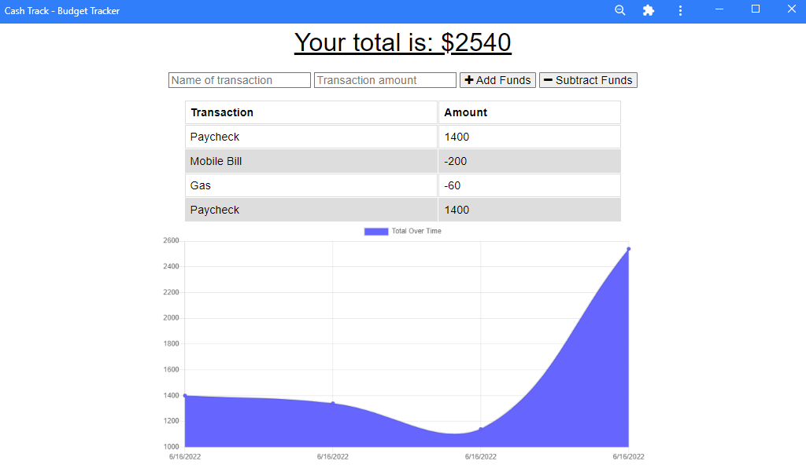

# **Cash Tracker**

## **Thumbnail**

## **Description**

- A PWA that allows the user to keep track of their budget both online and offline.

## **Built With**

- Javascript
- MongoDB
- Mongoose
- indexDB

## **Table of Contents**

- [Installation](#installation)
- [Usage](#usage)
- [License](#license)
- [Contributing](#contributing)
- [Questions](#questions)
- [Deployment](#deployment)

## **Installation**

- Download app to run || npm start

## **Usage**

- Follow onscreen prompts

## **License**

- Unlicense

## **Contributing**

How to Contrubute

- Open Source Baby!

## **Questions**

Made with ❤️💧🩸

- www.github.com/JonCurls

## **Deployment**

https://limitless-dawn-07480.herokuapp.com/
https://github.com/JonCurls/Cash-Track
